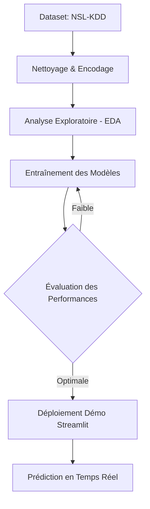

# 🛡️ Fiche Projet : Détection d'Intrusion Réseau (Sécurité)

## 1. 📝 Contexte

La **cybersécurité** est un enjeu majeur : chaque jour, des millions de tentatives d'intrusion ont lieu sur des systèmes informatiques. 

L'objectif de ce projet est de développer un **système d'IA** capable de détecter les attaques réseau à partir de données publiques d'intrusion, en distinguant le **trafic normal** des **attaques**.

---

## 2. 🎓 Objectifs Pédagogiques

- [ ] **Manipuler** un dataset de sécurité réel (ex. *KDD Cup 1999*, *NSL-KDD*, *CICIDS2017*).
- [ ] **Construire** un modèle de détection d'anomalies pour classer le trafic (Normal vs Malveillant).
- [ ] **Comprendre** l'importance des métriques adaptées en sécurité (Précision vs Rappel).
- [ ] **Réfléchir** aux limites des modèles IA en cybersécurité (fausses alertes, attaques adverses).

---

## 3. 🎯 Résultats Attendus

*   **Modèle de classification** : Un classifieur binaire (Normal / Attaque) ou multi-classes (DoS, Probe, R2L, U2R...).
*   **Visualisations** : Matrice de confusion, importance des caractéristiques (protocoles, ports, flags).
*   **Interface Démo** : Une mini-interface permettant de tester une connexion fictive et d'identifier si elle est suspecte.

---

## 4. 🚀 Étapes de Réalisation

### 1. Préparation des Données
*   **Dataset** : Choisir un dataset open-source (**NSL-KDD** recommandé).
*   **Preprocessing** : Nettoyage, encodage des variables catégorielles (protocoles, services).

### 2. Exploration (EDA)
*   Analyse de la répartition des classes et des corrélations.
*   Visualisation des caractéristiques les plus discriminantes.

### 3. Modélisation
*   **Baselines** : Régression Logistique, Random Forest.
*   **Avancé** : Gradient Boosting (XGBoost, LightGBM) ou Réseaux de Neurones.

### 4. Évaluation
*   **Métriques clés** : *Recall* (critique en sécurité), *F1-score*, *AUROC*.

### 5. Déploiement & Démo
*   **Outils** : Streamlit ou Gradio.
*   **Fonctionnalité** : Saisir les caractéristiques d'une connexion $\rightarrow$ Prédiction du statut.

---

## 📊 Flux de Travail (Workflow)

---

## 5. ✅ Critères de Réussite

- [x] Détection efficace des attaques.
- [x] Analyse détaillée des performances via la matrice de confusion.
- [x] Visualisations claires et interprétables.
- [ ] **Bonus** : Tableau de bord simulant un flux réseau en temps réel.
